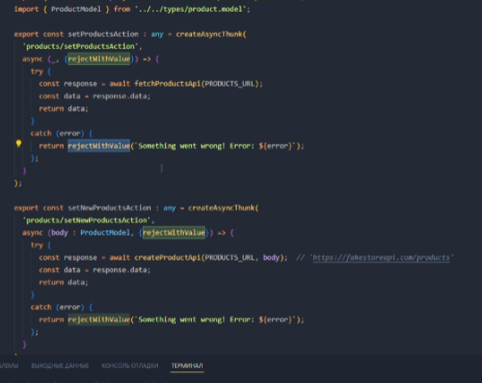
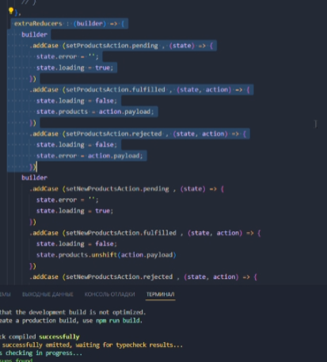

# Задание 3. Redux

## Подключение

- Читаем, что такое [Redux](https://redux.js.org/introduction/getting-started)
- Устанавливаем [Redux Toolkit](https://redux-toolkit.js.org/introduction/getting-started)

```
npm install @reduxjs/toolkit --save
```

- Устанавливаем пакет для React

```
npm install react-redux --save
```

## Конфигурация Redux

- Читаем про то, [как настроить Redux](https://redux-toolkit.js.org/tutorials/quick-start)
- Создаем [стор](https://redux-toolkit.js.org/tutorials/quick-start#create-a-redux-store) в файле `store.ts` в паке `store`.
- Добавьте полученный [стор в react](https://redux-toolkit.js.org/tutorials/quick-start#provide-the-redux-store-to-react)

### Создание Redux Reducer

- В папке `models`, создаем папку `state`. В ней будут лежать модели стейта.
- В Папке `models/state` создаём файл `product-state.model.ts` в котором будет интерфейс `ProductStateModel`
- Добавьте в интерфейс поле `products` с типом `ProductModel[]`
- В папке `store` создайте папку `product` с файлом `product.slice.ts` и в нём [создайте слайс](https://redux-toolkit.js.org/tutorials/quick-start#create-a-redux-state-slice). В качестве начального значения для `products` используйте `[]`
- [Добавьте созданный slice в redux](https://redux-toolkit.js.org/tutorials/quick-start#add-slice-reducers-to-the-store)

### Создание Redux Action

Добавим возможность складывать загруженные продукты в стейт.

- Создадим экшен в `product.slice.ts` c названием `setProductsAction`.
- В качестве аргумента он будет принимать список продуктов: `ProductModel[]` /////// вроде сделано .......

### Создание Redux Selector

Добавим возможность получать данные из стейта в компонентах.

- Создадим файл `product.selectors.ts` в `store/product`
- Добавим селектор для стейта продукта:

```ts
const selectProductState: (state: RootState) => ProductStateModel = (
  state: RootState
) => state.product;

export const selectProducts = (state: RootState) =>
  selectProductState(state).products;
```

- Добавим селектор для списка продуктов

## Задание

1. Перепишите логику `product-api.service.ts` и сохраните список продуктов в стейте.
2. Используйте селекторы и получите список продуктов из стейта в хуке `useProducts`.

Сейчас получили данные и расположили на странице сделать экшн через createAction И записать все данные туда


СОздать экстра слайс


Промис у нас асинхронный, стейт у нас меняется и страница перерисовывается.
Через хук разбираем, достаём и отрисовываем на странице.

Пользователь что-то сделал, в useEffect у нас пришел промис с нашими данные с api. Мы в нём юзаем dispatch. Чтобы сделать запрос через redax нужен dispatch. В хуке вызываем асинхронный экшн.
В useEffect мы передаём dispatch, который как раз

Селектор нам нужен чтобы страница узнавала об изменениях которые произошли.

Вызвав диспатч, вызываем редюсер, а он влияет на стейт(изменяет)
